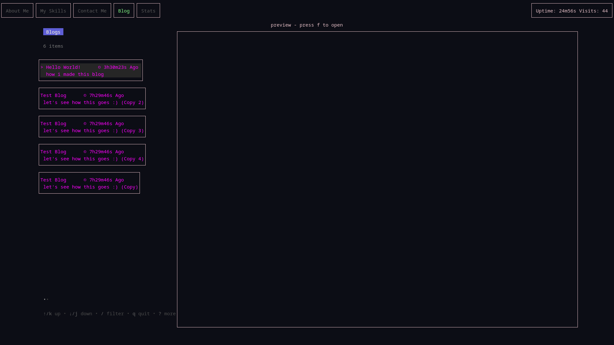
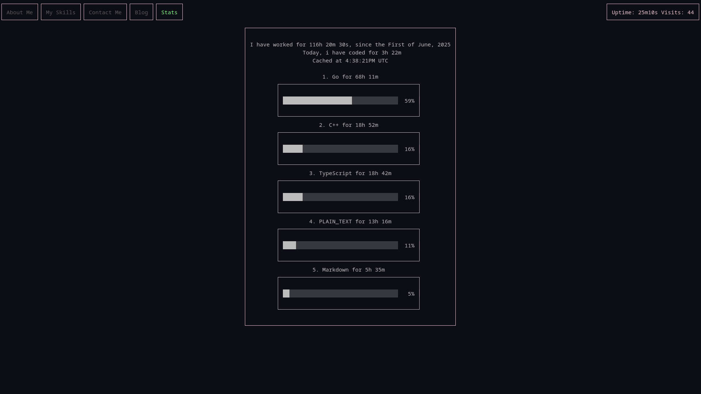
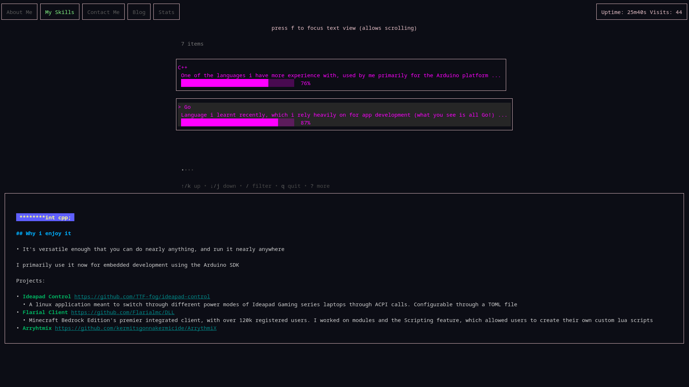

# SSH Portfolio
I hate web design, and what better way to avoid it and _still_ make a cool portfolio then to use SSH (i'd argue that gives cool points)
This is a TUI served over SSH using Bubbletea and Wish from Charmbracelet (my goat)
Features:
- Dynamic Loading of Content
  - everything written here involves zero recompilations to view
- Hackatime Stats Page
  - cached, reducing connection time
- Blog Page
- Skills Page
  - Shows an overview of all my skills
- Contact Me
  - easy way to contact me
- markdown rendering
- uptime and visits counter

Images - 

